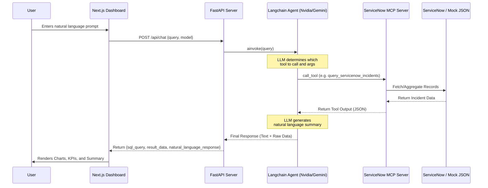

# Natural Language Incident Analytics and Reporting - System Documentation

This document outlines the architecture, components, and data flow of the Natural Language Incident Analytics and Reporting application. 

## High-Level Architecture

The system is a full-stack web application designed to allow users to interact with their ServiceNow incident data using natural language queries. It consists of three primary layers:

1. **Frontend**: A React/Next.js dashboard with interactive visualizations.
2. **Backend**: A FastAPI server that orchestrates LLM queries.
3. **MCP Server**: A standalone Model Context Protocol (MCP) server that acts as the bridge to the ServiceNow database (or a local mock database).

### Architectural Flow Diagram

## Core Components

### 1. Frontend (`frontend/src/app/page.tsx`)
- **Technology**: Next.js, React, TailwindCSS, Recharts.
- **Responsibility**: Provides the user interface. It renders dynamic KPIs based on the global dataset or the currently filtered dataset. It visualizes the returned data using `recharts` (Bar, Pie, or Line charts) and provides PDF export functionality using `jspdf`.
- **Key Features**: 
  - Dynamic Drill-down: Clicking on a chart element fires a `/api/drilldown` request to fetch the specific incidents belonging to that group.
  - PDF Export: Captures hidden fixed-size SVGs of the charts and raw data tables and generates a styled PDF report.

### 2. Backend API (`backend/src/main.py`)
- **Technology**: FastAPI, Python.
- **Responsibility**: Serves as the middleman between the client and the AI logic. Exposes the `/api/chat`, `/api/drilldown`, and `/api/kpis` endpoints.
- **Key Features**: Handles cross-origin requests (CORS) and catches deep-level exceptions to prevent server crashes.

### 3. LLM Agent (`backend/src/agent/llm_agent.py`)
- **Technology**: Langchain, NVIDIA NIM (`llama-3.2-11b`), Google Generative AI (`gemini-3.5-flash`).
- **Responsibility**: Takes the user's plain-text query and translates it into structured tool calls.
- **Key Features**:
  - **Tool Binding**: Binds the MCP server's exposed tools to the chosen LLM.
  - **Fallback Mechanism**: If the primary NVIDIA API fails (e.g., due to rate limits), it automatically catches the exception and falls back to the Gemini model to ensure the user still gets a response.
  - **Empty Response Fallback**: If the LLM successfully fetches data but fails to output a conversational summary, the agent manually formats a bulleted list of the results.

### 4. ServiceNow MCP Server (`backend/src/database/servicenow_mcp.py`)
- **Technology**: FastMCP.
- **Responsibility**: Encapsulates all data-fetching logic into standardized tools that the LLM can securely execute.
- **Key Features**:
  - `query_servicenow_incidents`: Used for fetching lists of specific tickets (filtering by state, priority, or substring matches in the description).
  - `aggregate_servicenow_incidents`: Used for generating count-based metric breakdowns (e.g., tickets grouped by Assignment Group).
  - **Mock Data Fallback**: Attempts to connect to the live ServiceNow instance using credentials in `secrets.json` (linked via `.env`). If connection fails or credentials are missing, it gracefully degrades to serving data from `mock_incidents.json`.
